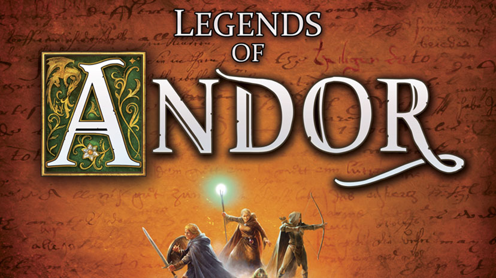
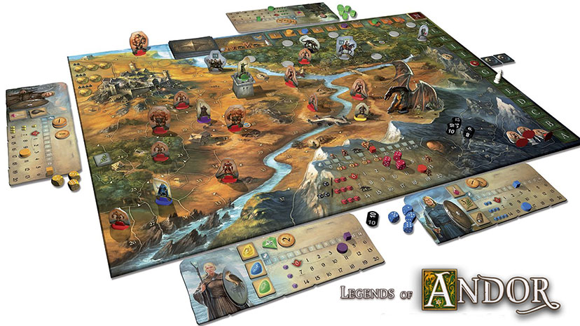

# Legends of Andor

## Team Members

- [Celine Huang](https://github.com/celinehuang)
- [Daphne Hegedus](https://github.com/drhegedus)
- [Haylee Luu](https://github.com/alinastarkov)
- [Kelly Rombough](https://github.com/kellyrombough)
- [Nikoo Sarraf](https://github.com/nikoosarraf)
- [Sasha Njini](https://github.com/snjini)

Computer game version of the popular [board game](https://boardgamegeek.com/boardgame/127398/legends-andor) by the same name. From the rulebook, the objective of the game is:

> **_Legends of Andor: Andor Legend 2_** is a cooperative game meaning all the players are on the same team of heroes that collectively work together to defend a fantasy realm from invading monsters. Therefore, either everyone wins or everyone loses.

Learning the game:

> **_Legends of Andor: Andor Legend 2_** has a unique narrative, the linked scenarios tell the story as the players complete objectives. For each scenario, or "Legend", a legend deck conveys the plot of event. A marker moves along the board's legend track at key points during each scenario, triggering the draw of a new legend card, the introducing new effects and the advances the story plot. In the end, the player guide the fate of Andor through their actions, bringing a happy ending to their epic fantasy tale.

## Rules

The rules for the game can be found [here](./andor_manual.pdf). You can also check out these helpful videos to see of [Andor Legend 2: Part 1](https://www.youtube.com/watch?v=qAeWVmiGnkw) and [Andor Legend 2: Part 2](https://www.youtube.com/watch?v=Z_jRgfAtx90).

## Models

The different models conceived during the development of the game are:

_Note: These models may not necessarily reflect the game as it stands today. Rather, they provide an insight into the initial thought process that existed while the game was being developed._

- [Project Sketch](./milestones/COMP361_M1.pdf)
- [Use Cases](./milestones/COMP361_M2.pdf)
- [Concept Model](./milestones/)
- [Environment Model](./milestones/)
- [Operational Model](./milestones/)

## Limitations

- A multiplayer (co-op) game only works out of the box on devices over the same network. (including VPN)

## Setup

### Prerequisites

### Installation

